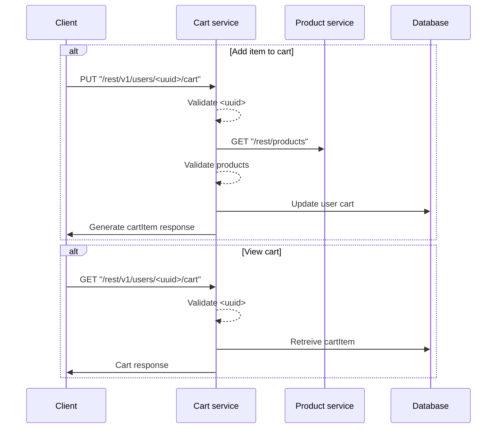


## Cart microservice for ESA Assignment 2

### Starting the service
1. Clone and run https://github.com/qurram-zaheer/esa_cart_api . While cart_api is running, you should see in the logs
> Server is listening on port 5000
2. Clone this repository, and navigate into it.
3. Run ``npm install``  to initialize the package.json dependancies.
4. Run ``npm start``.

### Usage
This is an emulation of a product microservice built on top of a RESTful cart_api service. A step-by-step walkthrough of the entire service is given below. 

-  Create a new user by sending a **POST** request to ``localhost:3000/rest/v1/register``
JSON format: 
	```json
	{ 
		"username": "your_username",
		"password": "your_password"
	 }
	```
- Get the list of products available in the catalogue by sending a **GET** request to ``localhost:3000/rest/v1/products/``
	You will get a reply that looks like this:
	```json
	{
	[
		{
			"productId": 0,
			"_id": "5e68afc6bbbf4767ea13c72b",
			"category": "laptop",
			"productName": "apple",
			"productModel": "macbook air",
			"price": 899,
			"availableQuantity": 30,
			"__v": 0
		},
		{
			"productId": 1,
			"_id": "5e68b8de9fa1086e28a5854a",
			"category": "tv",
			"productName": "sony",
			"productModel": "bravia",
			"price": 699,
			"availableQuantity": 500,
			"__v": 0
		}
	]
	```
- You can add an additional product to the catalogue by sending a **POST** request to `http://localhost:3000/rest/v1/products`
JSON format:
	```json
	{
	    "category": "your_category",
	    "productName": "your_product",
	    "productModel": "your_model",
	    "price": "your_price",
	    "availableQuantity": "your_quantity"
	}
	```
- You can add a product using its unique productId to a user cart by sending a **PUT** request to `http://localhost:3000/rest/v1/users/*{your_username}*/cart`
JSON format:
	```json
	{
		"productId": your_productId
	}
	```
- You can view a users current cart by sending a **GET** request to `http://localhost:3000/rest/v1/users/*{your_username}*/cart`
You will get a response with each cart item and its quantities mapped by the productId. 
	>**NOTE:** The response from the get request consists of two JSONs, the first JSON will contain details about each of the products in the cart, and the second JSON will contain the productId of each of the products in the cart and their respective quantities. 

	You will get a response that looks like this:
	```json
	{
		"products": [
			{
				"productId": 0,
				"_id": "5e68afc6bbbf4767ea13c72b",
				"category": "laptop",
				"productName": "apple",
				"productModel": "macbook air",
				"price": 899,
				"availableQuantity": 3,
				"__v": 0
			},
			{
				"productId": 1,
				"_id": "5e68b8de9fa1086e28a5854a",
				"category": "tv",
				"productName": "sony",
				"productModel": "bravia",
				"price": 699,
				"availableQuantity": 500,
				"__v": 0
			}
		],
		"quantities": [
			{
				"qty": 13,
				"_id": "5e6dbff6f2cbd2c3797de9cf",
				"productId": 0
			},
			{
				"qty": 2,
				"_id": "5e6dc1cb878a55c525c67da0",
				"productId": 1
			}
		]
	}
	```
	You can simply map the quantities of each product using the productId.

### How it works



	
	   


